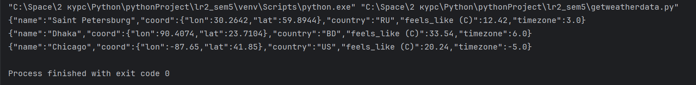

# openweatherapi

### Гиниятуллина Юлия Сергеевна, 3 курс, 2.2.

## Описание задачи
Реализована функция  ```get_weather_data(place, api_key=None)``` , которая получает данные о погоде с сайта https://openweathermap.org/. 


Функция возвращает объект в формате JSON, включающий: 
- информацию о названии города (в контексте openweathermap),
- код страны,
- широту и долготу, на которой он находится,
- его временной зоне в формате UTC,
- а также о значении температуры в Цельсиях.


Для организации запросов использован модуль ```requests```. Для кодирования и декодирования ```json``` - одноименный модуль.

Также были описаны тесты для функции в модуле getweatherdata_test.py

Демонстрация работы функции на примере городов: Санкт-Петербург, Дакка, Чикаго


Демонстрация работы тестов


